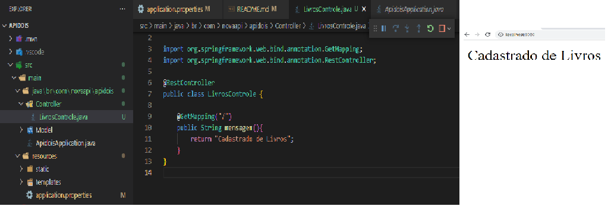
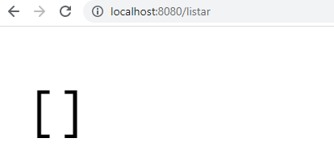

# projetoIndividual
Desenvolvendo Projeto de Maven, uma classe para cadastro, consulta, atualizacao e exclusao de Livros via ThunderClient.
Nesse segundo projeto, ja faremos a validacao do preenchimento dos atributos como obrigatorios na classe respostaModelo.

Criamos uma classe servicos para compor o modelo de negocio da classe Modelo

Obetivo:
<h4>Criar API para recebimentos de informacoes e testes de endpoints</h4>
{
<h4>Estabelecida conexão do servidor com o navegador da API (funcionando)</h4>

<h4>Estabelecida conexão com o banco de dados e geradas a listagem dos itens que serão cadastrados</h4>

}

<strong>Back-end</strong>
<ul>
    <li>Java</li>
    <li>Ecosystem Spring</li>
    <li>Projeto Maven</li>
    <li>Extensao: ThunderClient</li>
</ul> 