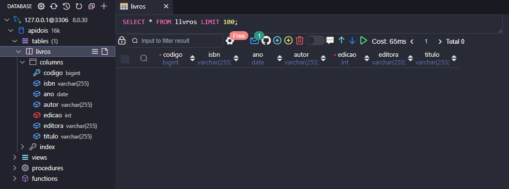
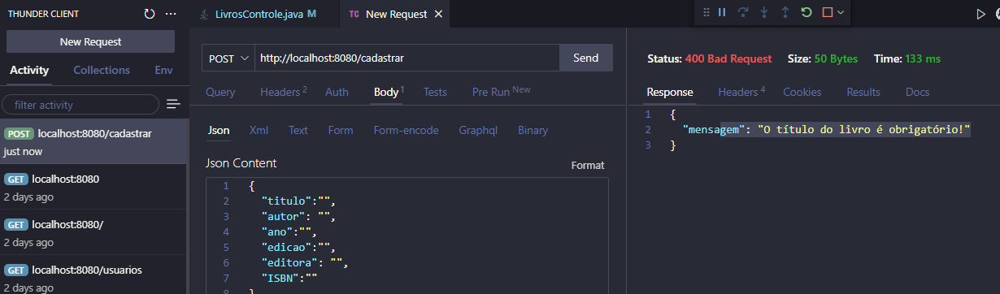
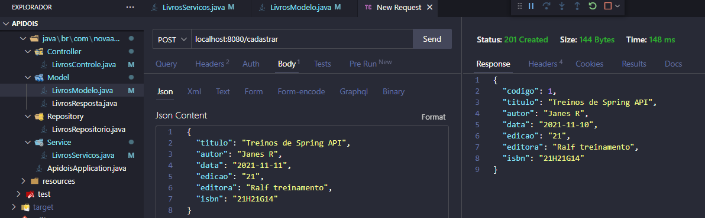

# projetoIndividual
<h2>Desenvolvendo Projeto Maven, uma classe para cadastro, consulta de Livros via ThunderClient ou URL.</h2>
Nesse segundo projeto, ja faremos a validacao do preenchimento dos atributos como obrigatorios na classe respostaModelo.

Criamos uma classe servicos para compor as regras de negocio da classe Modelo.

<h3>Objetivo:</h3>
<h4>Criar API para recebimentos de informacoes e testes de endpoints</h4>
{
<h4>Estabelecida conexão do servidor com o navegador através da API (funcionando)</h4>

<h4>Estabelecida conexão com o banco de dados e geradas a listagem dos itens que serão cadastrados</h4>

<h4>No primeiro momento a listagem está vazia pois ainda não há nenhuma item</h4>

<h4>A regra de negócio da solicitação obrigatória do preenchimento dos campos atendida</h4>
<h4>Para todos os campos a obrigatoriedade do preenchimento foi teste e com resposta, vinda do Modelo Classe Resposta</h4>
<h3>Objetivo desse segundo projeto comprido</h3>

<h4>Requisição completa finalizada e sucesso</h4>

}

<strong>Back-end</strong>
<ul>
    <li>Java</li>
    <li>Ecosystem Spring</li>
    <li>Projeto Maven</li>
    <li>Extensao: ThunderClient</li>
</ul> 
<strong>Banco de Dados</strong>
<ul>
    <li>MySql</li>
    <li>Extensao: Database manager for MYYSQL</li>
</ul> 