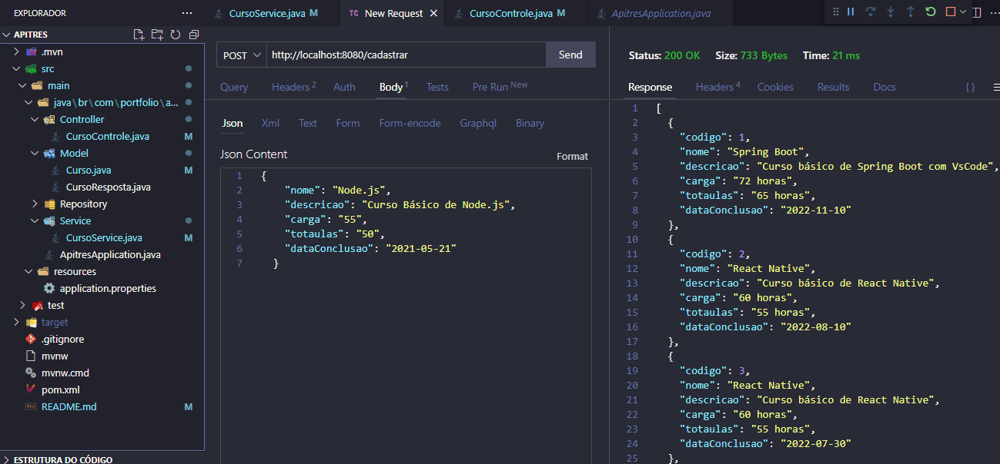
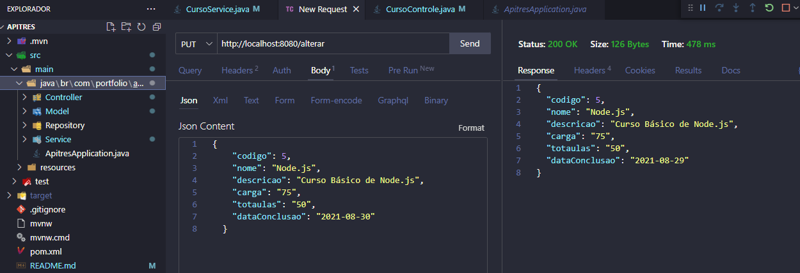
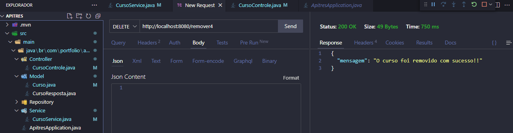
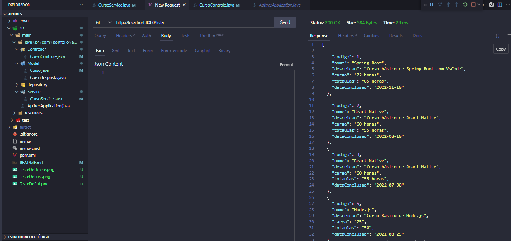

# projetoIndividual
<h2>Desenvolvendo Projeto Maven, uma classe para cadastro, atualizacao, selecao e exclusao dos atributos dos itens (Cursos) via ThunderClient e\ou URL.</h2>
<h3>Nesse Terceiro projeto, faremos todas as requisicoes mais usuais (GET, POST, PUT, DELETE).</h3>

<h3>Criamos uma classe servicos para compor as regras de negocio da classe Modelo.</h3>

<h3>Objetivo:</h3>
<h4>Criar API de uma Entidade para recebimentos de alteracoes de informacoes e testes de endpoints</h4>
<h3>Passos:</h3>
{
<h4>Teste da requisição Post - envio de informações de cursos a cadastrar.</h4>

<h4>Teste da requisição Put - envio de correções/atualizações dos cursos cadastradas.</h4>

<h4>Teste da requisição Delete - removendo itens da listagem de cursos, através da busca por Id.</h4>

<h4>Verificação do status da listagem dos cursos, após o teste de exclusão.</h4>

<h3>Objetivo concluído. A api está cadastrando, atualizando, delete e selecionando itens cadastrados</h3>
}

<strong>Back-end</strong>
<ul>
    <li>Java</li>
    <li>Ecosystem Spring</li>
    <li>Projeto Maven</li>
    <li>Extensao: ThunderClient</li>
</ul> 
<strong>Banco de Dados</strong>
<ul>
    <li>MySql</li>
    <li>Extensao: Database manager for MYYSQL</li>
</ul> 