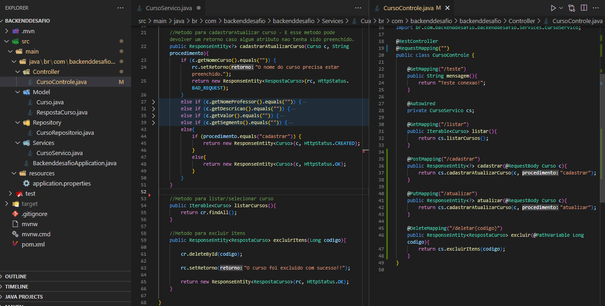
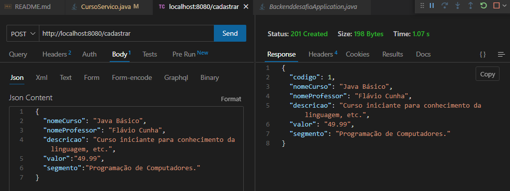

# projetoIndividual

<h1>
    Desenvolvendo Projeto Full Stack (Front-end, Banco de Dados e Conexão Back-end..) para emissão de certificado do curso ()=>{
        <h3>Spring Boot e React</h3>
    }
</h1>

<h4>Link do curso: https://ralflima.com/treinamentos/spring_boot_e_react/spring_modulo2_introducao.php</h4>

Obetivo =()=>{
<h3>
    <ul>
        <li>
            Projeto final para obter o certificado.
            Parabéns por ter chego nessa etapa, isso significa que você acompanhou o curso e quer testar seu conheciento e receber o certificado. Veja abaixo as questões e faça o envio dos arquivos:
            Desenvolver uma API para gerenciar cursos, será possível: cadastrar, selecionar, alterar e remover os registros, veja abaixo os demais requisitos:
        </li>
        <li><strong>Post:</strong> Deverá ser informado o nome do curso, professor, descrição do curso, valor e segmento (exemplo: Design Gráfico ou Front-end).</li>
        <li><strong>Get:</strong> Deverá listar os dados dos cursos cadastrados;</li>
        <li><strong>Update:</strong> Através do código do curso, altere todos os dados;</li>
        <li><strong>Delete:</strong> Através do código do curso, remova aquele curso;</li>
        <li>No front-end, teremos uma aplicação em React para poder realizar as requisições para a API de cursos.</li>
        <li>Será necessário criar validações no front-end e no back-end para a realização das requisições com a API.</li>
    </ul>
</h3>

}

<h1>Etapas do projeto FullStack:</h1>
<h2>1. Back-End incorporado com a Entidade, camada de serviços, repositório e rotas/controle.</h2>
{
<h3>Entidade Curso incorporada, camadas de serviços/controle(listar) aplicada. O retorno foi apenas um `[]` pois ainda esta vazio a lista, mas a conexao foi estabelecida. Camada Repositorio incorporada.</h3>

<h3>Camadas de servico e controle atualizada com os metodos do CRUD {create, read, update, delete}. As regras de negocio na camada de servico, a chamada dos metodos e rotas de controle na camada de controle.</h3>

<h3>Teste de Validação da API para cadastramento de informações e requimento da obrigatoriedade dos campos a ser preenchidos.</h3>

<h3>API em funcinamento, validado.</h3>

<h3>Teste do backend efetuado corretamente.</h3>

<h2>2. Front-end, ... <strong>Formulário</strong> para inserção de dados e <strong>Tabela</strong> para listar esses dados.</h2>
<h3>Desenhando front-end para receber informacoes que serao enviadas para o banco de dados via back-end.</h3>

<h2>3. Conexão Front-end com Back-end ...<!-- estabalecida, conexão via ThunderClient e exibição via página, usando hooks. --></h2>
<h3>Front end para receber as informações e enviar no BD através do spring.</h3>

}

<h1>Tecnologias utilizadas</h1>
<strong>Front-end</strong>
<ul>
    <li>ReactJs</li>
        <ul>
            <li>HTML5</li>
            <li>CSS3</li>
        </ul>
    <li>Bootstrap React</li>
</ul>
<strong>Back-end</strong>
<ul>
    <li>Java</li>
    <li>SpringBoot</li>
        <ul>
            <li>JPA</li>
            <li>Lombok</li>
        </ul>
</ul>
<strong>Banco de Dados</strong>
<ul>
    <li>MySQL</li>
        <ul>
            <li>MySQL Driver</li>
        </ul>
</ul>
<strong>Extensões</strong>
<ul>
    <li>ThinderClient</li>
</ul>

<h1><strong>Como executar o projeto</strong></h1>
<ul>
    Clone o repositorio
    <strong>Front-end:</strong>
    
Instale as dependicias na sua IDE com o comando: npm install

    
Execute o projeto react em vite.js, através do comando: npm run dev.

    <strong>Back-end:</strong>
    
Tenha o spring instalado na máquina

    
A pasta Resources -> em application.properties altere "username - password" conforme suas definições

    <strong>DataBase:</strong>
    
Caso não utilize a extenção ThinderCliente, crie a classe "singlepage" em seu SGBD

    
</ul>

ResultadoObjetivo =()=>{
<h1>Objetivo do projeto concluído com sucesso.</h1>
<h3>Teste de validação de cadastro vindo do back-end, mostrando no Console e alert do Front-end</h3>

<h1><!-- Objetivo do projeto concluído com sucesso! --></h1>

}
